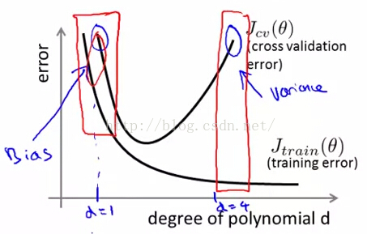
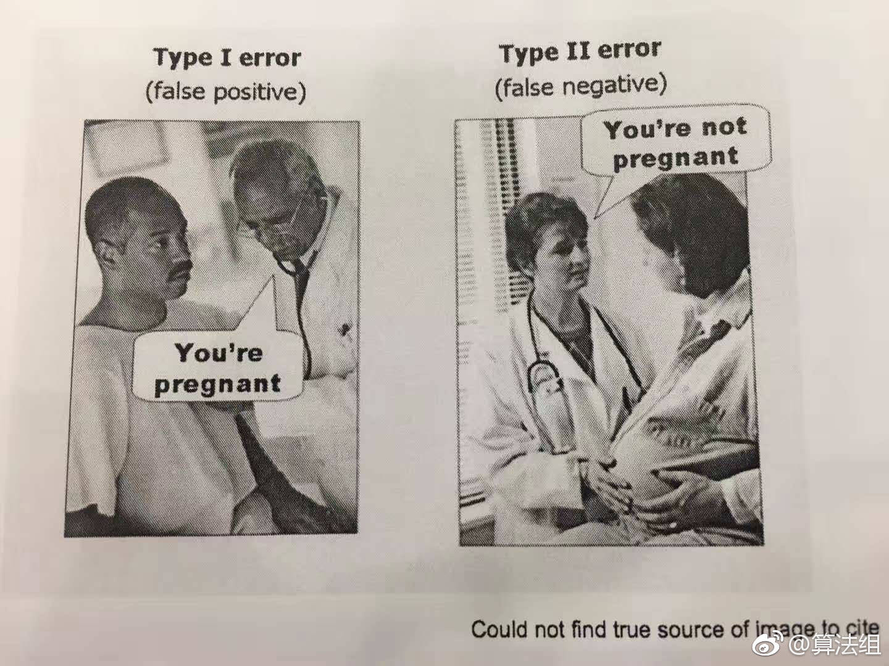

1. 贝叶斯 
w类别 
x样本 
P(w)先验类频率，先验概率 
P(x|w)条件找样本 
P(w|x)后验判类别，x在w上的后验概率 

$$P(x,w)=P(w)P(x|w)=P(x)P(w|x)$$

$$P(w)P(x|w) \approx  P(w|x)$$

通常认为P(x)都是固定的或者说$\frac{1}{n}$基本都相同，因为样本一般会有差异而且不同，而类别一般会出现重复 

2. 过拟合与欠拟合 
 
我们以情感为例： 
如果运气很差，遇到所有的男生无一例外都并非合适的恋爱对象，当然这只是一个小概率事件，只是凑巧就发生在你身上，造成了你产生‘男生都不是好东西’的判断，这就是一种欠拟合 
如何你非常优秀而且眼光非常的高(就像某某某那样换过很多很多男朋友),当下已经忘却了曾经遇到过那些人的曾经优秀，而逐渐的感觉到身边男生的质量越来越差，并产生‘所有男生都不是好东西’，这就是过拟合 

3. 关于假阳和假阴 

TP:前者表示预测的状态，对或者错，后者表示将。预测为P或者N
两者都站在 
查准率：（从预测结果的角度）考虑预测为正类的分布，因为有一些是负类倍错误的预测为了正类。预测出的正类中有多少概率是可信的
“被你预测为正例的样本中有多少是对的” 
查全率：（从原本样本的角度）考虑正类的回收，因为有一些 正类被预测成了负类。也就是多少概率正类被预测回来。
“正例里你的预测覆盖了多少” 
FP：假正，将负的预测为正的。所以与字面意思一样，但是请记住前者一定表示状态。注意假和负，对与正的区别！！！！ 

人们往往更加关注糟糕的情况：
判断结果为positive等价于：阳性，验证通过 

假阳性：其中阴性是指不患病。而假阳性是把阴性-》阳性，也就是不患病判断为患病，这种情况就比较可怕。 
正如开门的时候人们更加关注验证通过，是房屋主人（这里就相当于判断为阳性）进入的情况。 

4. HMM模型 

设想从若干个盒子里取出一些球，每个盒子里有着不同比例的红白球各若干个，
按照一定的规则在这几个盒子里先后取出一些球构成一个颜色的观测序列，但不知道每个球
从哪些盒子里依次取出的状态序列。前者可观测，而后者隐藏。
HMM模型一般需要根据规则、初始状态分布、观测概论分布，
求最终的观测序列的概率大小。

5. RNN模型
 

6. LSTM为什么比RNN效果更好

梯度爆炸一般靠裁剪后的优化算法即可解决，
比如gradient clipping(如果梯度的范数大于某个给定值，将梯度同比收缩)。
$S_t = f(W*(S_{t-1}，X_t)+b)$
$S_t = f_t*S_{t-1}+i_t*f(S_{t-1})$

（1）原始的lstm是没有forget gate的，或者说相当于forget gate恒为1，所以不存在梯度消失问题

（2）现在的lstm被引入了forget gate,但是lstm的一个初始化技巧就是将forget gate的bias置为正数
  （例如1或5，这点可以查看各大框架代码），这样模型刚开始训练时forget gate的值接近于1，不会发生梯度消失

（3）随着训练过程的进行，forget gate就不再恒为1了。
    不过对于一个已经训练好的模型，需要选择性地记住或者遗忘某些信息，所以forget gate要么是1，
    要么是0，很少有类似0.5这样的中间值，相当于一个二元的开关。
    例如在某个序列里，forget gate全为1，那么梯度不会消失；否则，若某一个forget gate是0，
    这时候虽然会导致梯度消失，但是体现了模型的选择性，刻意遗忘某些信息

5. MCMC模型

