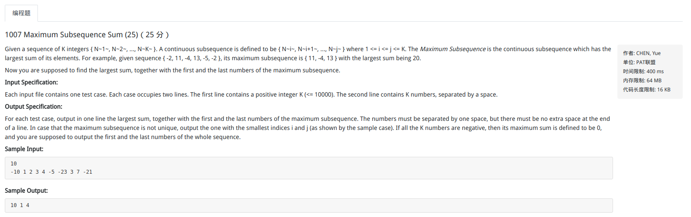

# 8月刷题整理
1. 字符串1)：<br>
给定一个字符串，返回字符串中不在括号内的内容。已知括号对都是正确的，不存在左括号或者右括号缺失的问题。括号类型：(), []<br>
example:<br>
input: [ab]word((c)dd)s<br>
output: words<br>


```python
a='[ab]word((c)dd)s'
flag=[0];
out=''
for i in range(len(a)):
    if (a[i]=='[') | (a[i]=='('):
        flag+=[flag[i]+1]
    elif (i>=1) & ( (a[i-1]==')') | (a[i-1]==']') ):
        flag+=[flag[i]-1]
    else:
        flag+=[flag[i]]
    if flag[i+1]==0:
        out+=a[i]
print out
```


2. PTA1007
<br>
```python
# strN='10'
# strArray='-10 4 3 3 4 -5 -23 3 7 -21'.strip()
# strN='6'
# strArray='-2 11 -4 13 -5 -2'.strip()
# 在两个的情况下没有考虑到
# strN='2'
# strArray='-1 2'.strip()
#这个就没有办法了！！！觉得和题目的意思不符合, 按照答案就应该输出0 0 0
# strN='4'
# strArray='-1 0 0 -1'.strip()
# import sys
# strN=sys.stdin.readline().strip()
# strArray=sys.stdin.readline().strip()
# 其实只有一个测试用例不通过，时间复杂度的问题
# 最主要是要记住一个问题：
N=int(strN)
strA=strArray.split(' ')
A=[int(a) for a in strA]
flag=0
for i in range(N):
    if A[i]>0:
        flag=1
if flag==0:
    outStr = '0' + ' ' + str(A[0]) + ' ' + str(A[N-1])
    print outStr
    exit()

state = [0, 0, 0]
S=[[0 for aa in A]]
for i in range(N,0,-1):
    # print i
    temp=[]
    space = N - i
    for j in range(i):
        v=S[N-i][j]+A[j+space]
        temp+=[v]
    S+=[temp]
    mt=max(temp)
    ind=temp.index(mt)
    # state = [mt, ind, ind+space]
    if (mt>state[0]):
        state[0]=mt
        state[1]=A[ind]
        state[2]=A[ind+space]
    elif (mt==state[0])&(ind<state[1]):
        state[1]=A[ind]
        state[2]=A[ind+space]

outStr=str(state[0])+' '+str(state[1])+' '+str(state[2])
print outStr
```

# PAT 1045 LIS最长不降子列 
```python
a='2,1,5,3,6,4,8,9,7,8,9'
a='2,1,5,3,6,4,2,2,4,2,2,2,2,4'
# a='2,1,5,3,6,4,8,9,7'
A=map(int, a.split(','))
N=len(A)
def findBi(a, v):
    # a
    low=0
    end=len(a)-1
    high=end

    while low<=high:
        mid = (low + high) / 2
        if a[mid]==v:
            while mid+1<=end and a[mid+1]==v:
                mid+=1
            return mid+1
        elif a[mid]>v:
            flag=1
            high=mid-1
        else:
            flag=2
            low=mid+1
    if flag==1:
        mid=mid
    else:
        mid=mid+1
    return mid
import copy
B=[A[0]]
v=A[0]
C=[]
#注意如果要输出序列；则只有可能在B发生增加元素的时候B中后续的更新才会有效！！！
for i in range(1,N):
    if A[i]>=v:
        B+=[A[i]]
        v=A[i]
        C=copy.deepcopy(B)
    else:
        ind=findBi(B,A[i])
        if ind<len(B):
            B[ind]=A[i]
        else:
            B+=[A[i]]
            C = copy.deepcopy(B)
print len(B)
print C
print B
```
